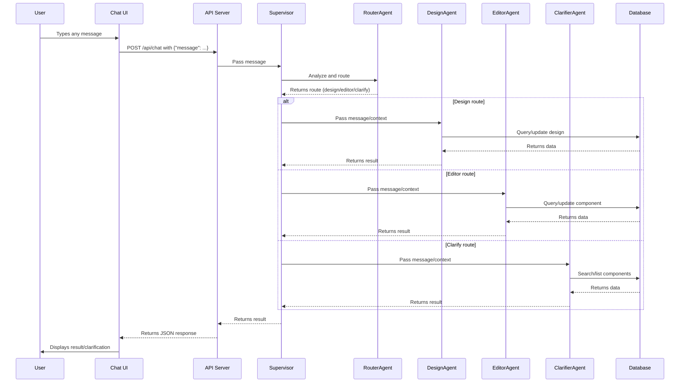

# Agent API Design: Chat-Based Multi-Agent System

This document describes the architecture, API, agent responsibilities, tool call structure, and data flow for the chat-based multi-agent backend system.

---

## 1. System Overview

- **Frontend (Chat UI):**  
  Users interact with the system via a conversational web interface.

- **API Server (Express):**  
  Exposes a single `/api/chat` endpoint for all chat messages.

- **Supervisor:**  
  Orchestrates the conversation, maintains state, and delegates tasks to agents.

- **RouterAgent:**  
  Uses LLM+rules to analyze each message and route it to the correct agent:

  - **DesignAgent** for design/layout/appearance changes.
  - **EditorAgent** for component CRUD and security group operations.
  - **ClarifierAgent** for ambiguous or underspecified component requests.

- **Agents:**  
  Each agent is a specialized module responsible for a specific domain.

- **Database:**  
  Stores all design and component data (via `lowdb` or SQL).

---

## 2. API Endpoint

### `POST /api/chat`

- **Request Body:**
  ```json
  {
  	"message": "<user's message>"
  }
  ```
- **Success Response:**
  ```json
  {
    "response": {
      "status": "success",
      "data": { ... } // Agent's result
    }
  }
  ```
- **Error Response:**
  ```json
  {
  	"response": {
  		"status": "error",
  		"message": "<error details>"
  	}
  }
  ```

---

## 3. Request Processing Flow

1. **User Message Intake**

   - User sends a message via the chat UI.
   - The frontend POSTs this message to `/api/chat`.

2. **API Server Handling**

   - Receives the message and forwards it to the Supervisor.

3. **Supervisor Orchestration**

   - Maintains conversation state and any pending operations.
   - Passes the message to the RouterAgent for routing.

4. **RouterAgent Decision**

   - Analyzes the message using LLM and strict rules:
     - **DesignAgent:** If message is about design, layout, style, or appearance.
     - **EditorAgent:** If message is about component CRUD or security, and a componentId is present.
     - **ClarifierAgent:** If the message is about components but lacks a componentId or is ambiguous.
   - Returns the chosen route to the Supervisor.

5. **Agent Execution**

   - **DesignAgent:**
     - Fetches current design and onboarding answers.
     - Handles design changes, always confirming with the user before updating.
     - Calls `updateDesign` or `getClientDesign` as needed.
   - **EditorAgent:**
     - Handles create, read, update, delete, and security group operations for components.
     - Maps user-friendly terms to schema fields.
     - Validates required parameters (clientId, componentId, etc.).
     - Calls `updateComponent`, `addComponent`, `deleteComponent`, etc.
   - **ClarifierAgent:**
     - Helps the user identify/select the correct component when info is missing.
     - Offers to list all components, or narrows down by description.
     - Calls `searchComponent` with parsed criteria.

6. **Database Operations**

   - Agents use their respective tools to interact with the database.
   - All updates are sanitized and mapped to the correct schema fields before writing.

7. **Response Construction**
   - Each agent returns a structured response (success, error, or clarification needed).
   - The Supervisor collects the agent’s response and sends it back to the API server.
   - The API server returns the response to the frontend.

---

## 4. Agent Responsibilities and Tool Call Structure

### 4.1. DesignAgent

- **Responsibilities:**

  - Only allows changes to user-controllable design elements (as defined in the prompt).
  - Always confirms intent before updating.
  - Rejects or clarifies ambiguous requests.
  - References onboarding answers for context.

- **Tool Calls:**

  - `getClientDesign`:
    ```json
    { "clientId": "<string>" }
    ```
  - `getQAForClient`:
    ```json
    { "clientId": "<string>" }
    ```
  - `updateDesign`:
    ```json
    {
      "clientId": "<string>",
      "designUpdates": { "<flat_key>": "<value>", ... }
    }
    ```

- **Response Format:**
  - For invalid requests: Show validation error with available options.
  - For valid requests: Summarize the intended change, ask for confirmation, and only proceed after user confirms.
  - For design viewing: Show current configuration.

### 4.2. EditorAgent

- **Responsibilities:**

  - Handles all component CRUD and security group operations.
  - Maps natural language to schema fields using a detailed mapping.
  - Validates all required parameters before proceeding.
  - Requests clarification if any required info is missing.

- **Tool Calls:**

  - `getComponent`:
    ```json
    { "clientId": "<string>", "componentId": "<string> (optional)" }
    ```
  - `updateComponent`:
    ```json
    { "clientId": "<string>", "componentId": "<string>", "updates": { ... } }
    ```
  - `addComponent`:
    ```json
    { "clientId": "<string>", "componentId": "<string> (optional)", "updates": { ... } }
    ```
  - `deleteComponent`:
    ```json
    { "clientId": "<string>", "componentId": "<string>" }
    ```
  - `addSecurityGroup` / `removeSecurityGroup`:
    ```json
    {
    	"clientId": "<string>",
    	"componentId": "<string>",
    	"security_group_title": "<string>"
    }
    ```

- **Response Format:**
  - Always provides confirmation of what was understood, action taken, result status, and next steps if applicable.
  - If required info is missing, responds with a clarification request and stops processing.

### 4.3. ClarifierAgent

- **Responsibilities:**

  - Assists when component info is missing or ambiguous.
  - Parses user descriptions into search criteria.
  - Offers to list all components or search by description.
  - Handles user selection of components when multiple matches are found.

- **Tool Calls:**

  - `searchComponent`:
    ```json
    { "clientId": "<string>", "criteria": { ... } }
    ```
    - If criteria is empty, returns all components for the client.

- **Response Format:**
  - If 0 results: Offers to show all components.
  - If 1 result: Returns componentId and details.
  - If multiple results: Shows numbered list for user selection.

---

## 5. Sequence Diagram



---

## 6. Database Interaction

- All database operations are performed by agent-specific tools.
- Design updates are sanitized and mapped to the correct JSONB fields.
- Component operations are mapped and validated before execution.

---

## 7. Extensibility

- New agents or tools can be added by updating the RouterAgent’s rules and implementing the agent logic.
- The system is modular: each agent is responsible for its own domain.
